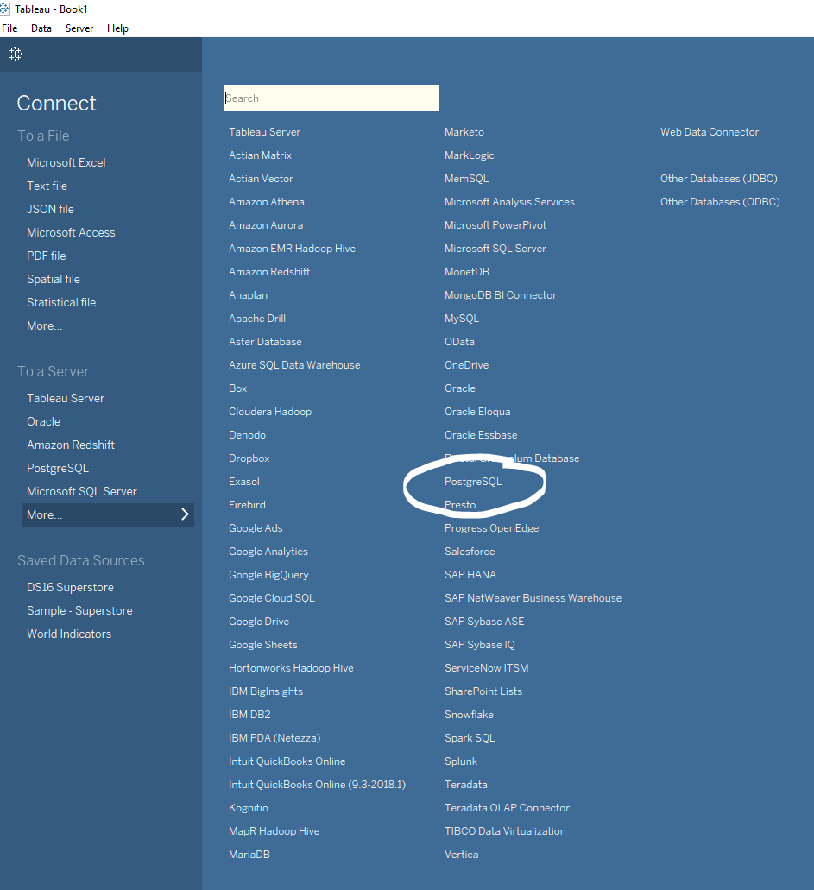
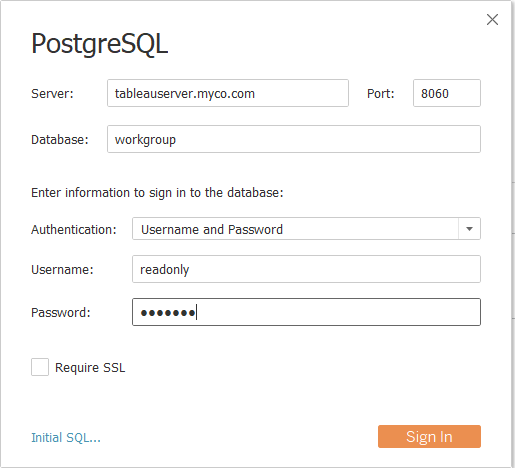

# Tableau

Tableau is a popular BI tool for interactive analysis.

Here're the steps to connect Tableau to Hologres.

## 1. Download Tableau Desktop

Download [Tableau Desktop](https://www.tableau.com/pricing/individual).

## 2. Connect to Hologres

Open Tableau Desktop, select "PostgreSQL" connector and fill in credentials.

- Server: host address of Hologres instance
- Port: port of Hologres instance
- Database: the Hologres database to connect to
- Authentication: select "Username and Password"
- Username: access id of the Hologres account
- Password: access key of the Hologres account
- Require SSL: no

## 3. Use Tableau with Hologres

Now you can use Tableau with Hologres for data analysis.