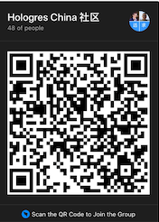

# Community and Getting Help

There are many ways to get in touch with and get help from the Hologres community.

## Feature Requests, feedbacks, issues, bugs 

For feature requests, feedbacks, issues, bugs, etc, please file a github issue at [https://github.com/hologres/hologres-issues/issues](https://github.com/hologres/hologres-issues/issues).

You can also search whether other people have run into similar situations, and add your context to the existing tickets.

## Slack Channel and Dingtalk Group

There are both a Hologres official Slack channel and a Dingtalk Group for informal discussions for devs and users. 

Slack channel: [https://hologres.slack.com/](https://hologres.slack.com/). To join, click [here](https://join.slack.com/t/hologres/shared_invite/zt-dcv7relz-CfYNN7NUr6_PSAMYXiXYnQ)

Dingtalk group: To join, scan the following QR code from your Dingtalk App 

 