# Quickstart with Tableau


## Tableau：

Tableau is an extremely powerful, secure and flexible end-to-end data analysis platform, providing a complete set of functions from connection to collaboration. Tableau Desktop is a visual data management tool of Tableau, which can provide real-time visual analysis by dragging and dropping, and quickly obtain practical results.

## Tableau Visualization While Connect With Hologres

While we are doing query with Hologres, a lot of BI tools could be used to show us visualized query result  only need a few steps which can make the query result more understandable, below we will example some queries to show u how easy of visualization by using Tableau.

## Data Source:

The data is from [the USA government]( http://www.transtats.bts.gov/DL_SelectFields.asp?Table_ID=236&DB_Short_Name=On-Time ) without a license and therefore assumed to be in the public domain in the United States. To see how upload these data into Hologres please refer to
This data shows the specific details about each flight such as filyear, filmonth, delay situation, etc, from this data we can clearly undestand how's each carrier operates and with these data we will be able to analyse the detail like below queries.
To learn how to load your data (CSV files）into hologres please refer to [Welcome to Honebox].

## Preparation work

### Preparation Work 1: Download Tableau Desktop:

Please follow the instruction : [Tableau Desktop](https://www.tableau.com/support/releases)

### Preparation Work 2: Connect to Hologres with Tableau

Choose PostgreSQL and fill in below necssary information


- Server: Hologres Instance Address
- Port: Hologres Port Address
- Database: Connected Hologres Database Name
- User Name: Hologres Account Access ID
- Password: Hologres Account Access Key
- Require SSL: No

After sign in you will see the table under your hologres


## Query visualization:

### Query 1:

#### Step 1: Add one custom SQL

Actually tableau supports to drag the capsle to columns and rows directly to show this report, but this data sample has so many values, to simplify the optional capsle we just add one custom SQL to help us select the relevant capsle that we need of each query demand.

For example we would like to know the total flight number of each day of week from 2000 to 2008


```
SELECT FltDayOfWeek, count(*) as c
FROM ontime
where FltYear>=2000 AND FltYear<=2008
GROUP BY FltDayOfWeek
ORDER BY c DESC
```

In this situantion we just input the query and click ok.


After input your query, the result of the query will be showed here:

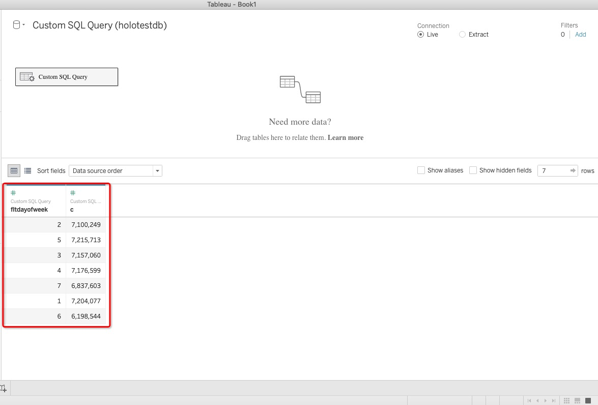

### Step 2: Create one work table, ensure each value in dimensions and measures

Notes：
Measure: usually is consist of a group of variable figures which can be calculated, and based on the calculated results, it represents quantifiable visual elements of the chart such as the area size, bar length, color depth, etc.
Dimension: mainly used to distinguish the calculation results of numerical variables(Measure), which are shown as visual elements that are difficult to quantify, such as chart color types, graphic positions, classification methods, etc.
Drag the Fltdayofwork to dimensions, and keep the value need to be caculated in measures(here the value is C)

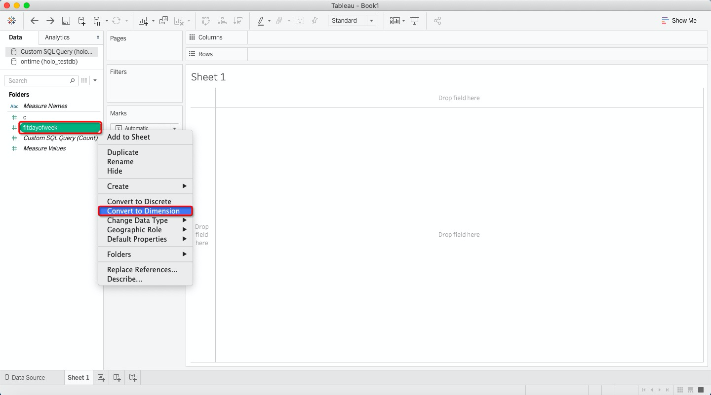

### Step 3: Drag the value to colomns and rows to show the report

Drag the dimension value capsule(Fltdayofwork) to colomns and drag the measure value capsule(C) to rows, as u can see we got the visualized report in the work list ( According to your perferance you can switch the colomns and rows)

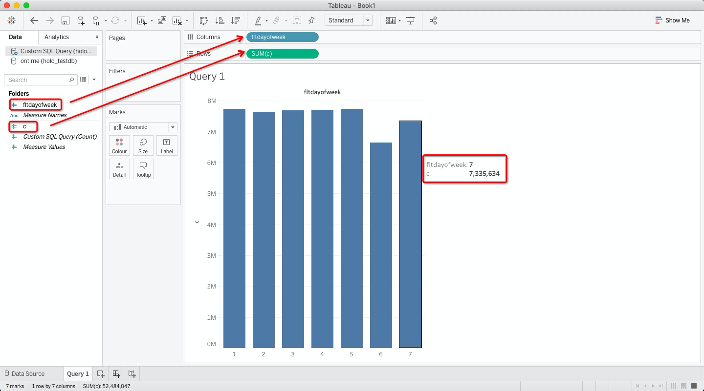

As you can see while u are putting ur cursor on the report, it will shows the exact flight numbers in dayofweek(7-Sunday) from 2000 to 2008.

### Query 2:

#### Step 1: Add one custom SQL

In this SQL we would like to know how many flights in total delaied according to different flights origin during 2000 to 2008

```
SELECT Origin, count(*) as c
FROM ontime
WHERE DepDelay>10 AND FltYear>=2000 AND FltYear<=2008
GROUP BY Origin
ORDER BY c DESC
LIMIT 10
```


SQL query result：


#### Step 2: Create one work table, ensure each value in dimensions and measures

According to different value attibutives，tableau displays each SQL's query result to its data type: here origin is under dimesions and C is under measures which need to be cacultated.

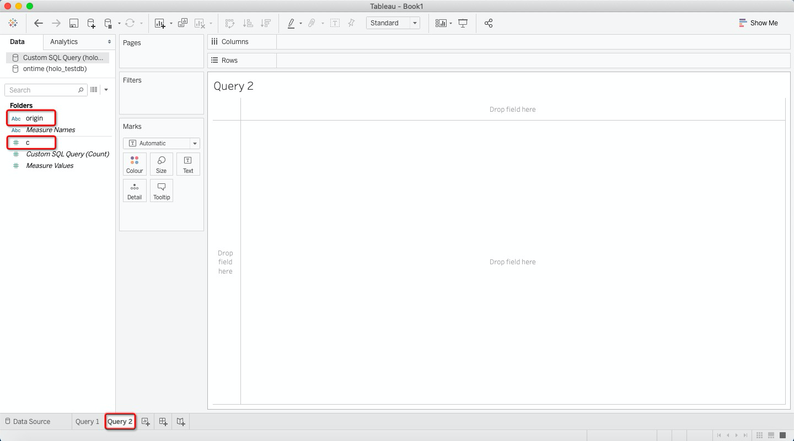

#### Step 3: Drag the value to colomns and rows to show the report

Drag origin to columns and c to rows, then we can see the report and while choosing any bar in the report you will be able to see the detailed graph.

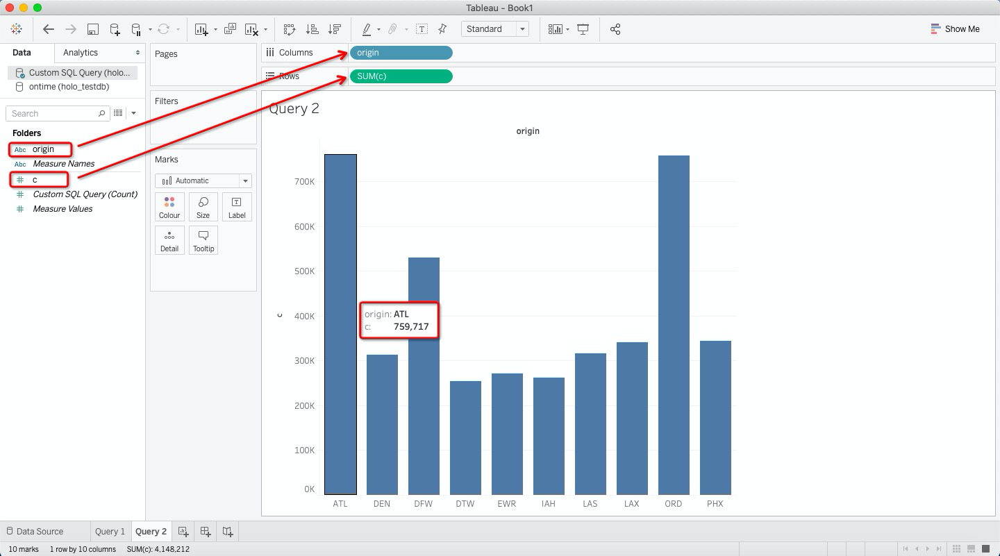

### Query 3:

#### Step 1: Add one custom SQL

Now we would like to figure out the departure delay（departure delay time>10min) ratio in 2007 according to different carriers

```
SELECT Carrier, c, c2, c*100/c2 as c3
FROM
( SELECT Carrier, count(*) as c FROM ontime WHERE depdelay>10 AND FltYear=2007 GROUP BY Carrier ) A
INNER JOIN
( SELECT Carrier, count(*) as c2 FROM ontime WHERE FltYear=2007 GROUP BY Carrier ) B using (Carrier)
ORDER BY c3 DESC
```

Add one new custom SQL, input SQL and click ok, result will be showed in the work area

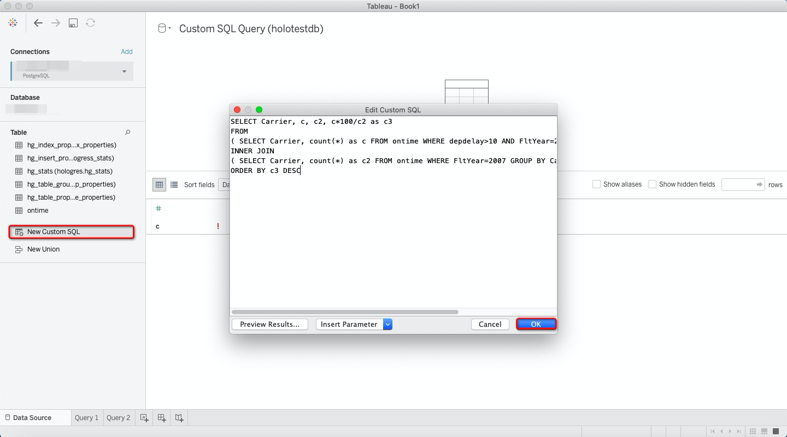

In this visualized report we can see each carriers total flights(c2), total departure delaid (more than 10 min) fight numbers(c1) and the delay ratio(c3) in 2007

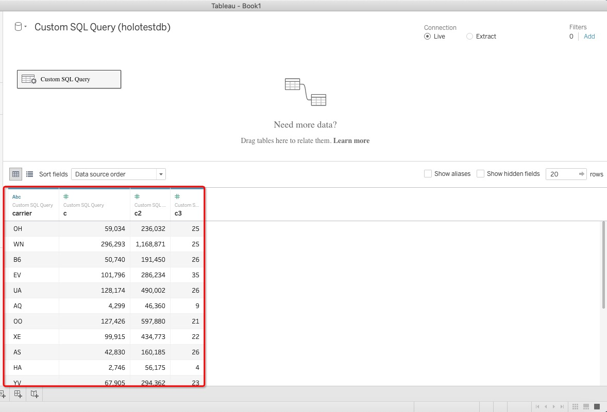

#### Step 2: Create one work table, ensure each value in dimensions and measures

In this work area，the dimensions and measures have already been matched by tableau automatically, we just need to check again whether the value has been put in the correct category, if not just shift it to the correct category as we have showed in query 1.

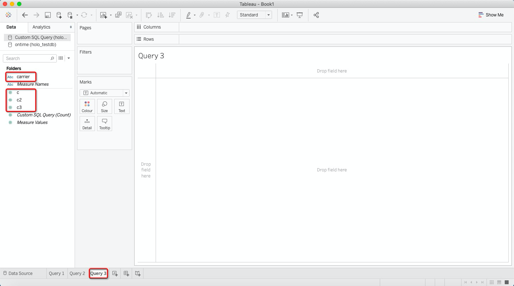

#### Step 3: Drag the value to colomns and rows to show the report

Drag carrier to columns, c and c2 to rows the the detail data will be showed as bar chart. In this report we put the delay ratio(c3) as label to each bar, which will be more clear, as usually we we click any of the bar the data of the sepecific carrier will be showed as diagram in the work area.

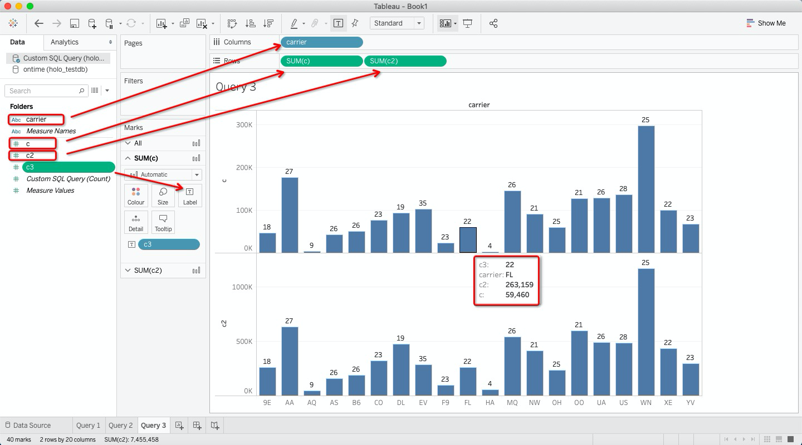

### Query 4:

#### Step 1: Add one custom SQL

This is one complex query, but it will also quite simple to be visualied in Tableau. In this Sql we aims to analyse different carriers arrive delay time sum total, and the total arrive delay rate before 2010

```
SELECT
min(FltYear),
max(FltYear),
Carrier,
count(*) as cnt,
sum(ArrDelayMinutes) as flights_delayed,
round(sum(ArrDelayMinutes)/count(*), 2) as rate
FROM ontime
WHERE
FltDayOfWeek not in (6,7) AND
OriginState not in ('ak', 'hi', 'pr', 'vi') AND
DestState not in ('ak', 'hi', 'pr', 'vi') AND
ArrDelayMinutes > 30 AND
FlightDate < '2010-01-01'
GROUP BY Carrier HAVING count(*)>100000 AND max(FltYear)>1990
ORDER BY rate DESC
LIMIT 1000
```

Same step as before add one new custom SQL and paste the sql here then the result will be showed as below:

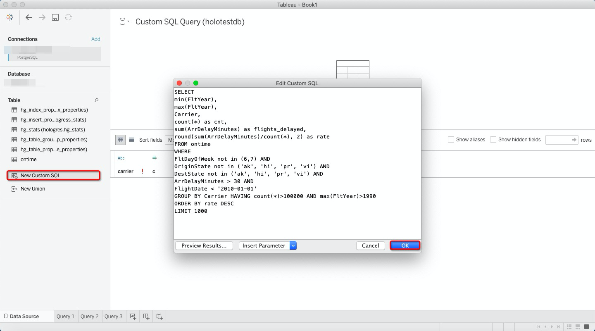


#### Step 2: Create one work table, ensure each value in dimensions and measures

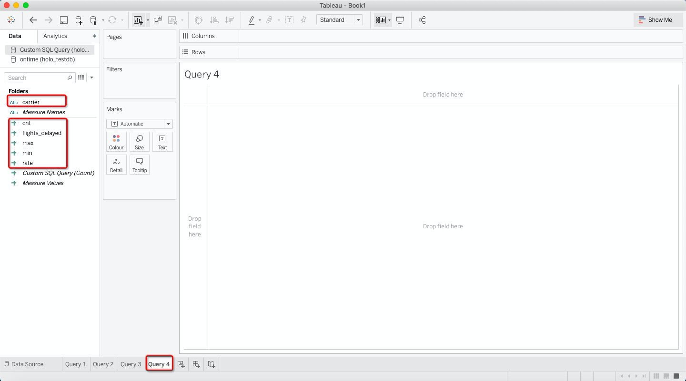

#### Step 3: Drag the value to colomns and rows to show the report

Drag carrier to columns


Drag cnt to rows


Drag max,min,rate as details(which will be showed when we click the bar as one graph)


Drag flights_delayed as label(for each carrier it directly show on the top of the coresponding bar)

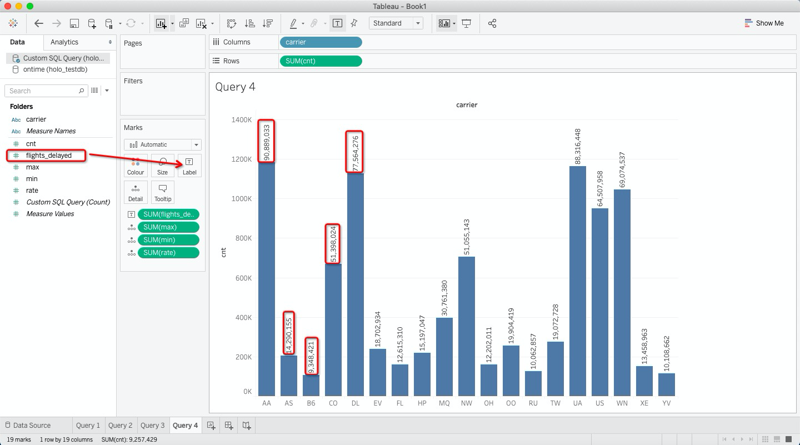

To make the report more clear, we can distinct the carrier by color, here just drag the left folders carrier dimension to color marks, and on the right of this work area, it shows the carrier legends.


Now the report has been finished while we are clicking each bars it will show us the detail and each labels in the graph as below.

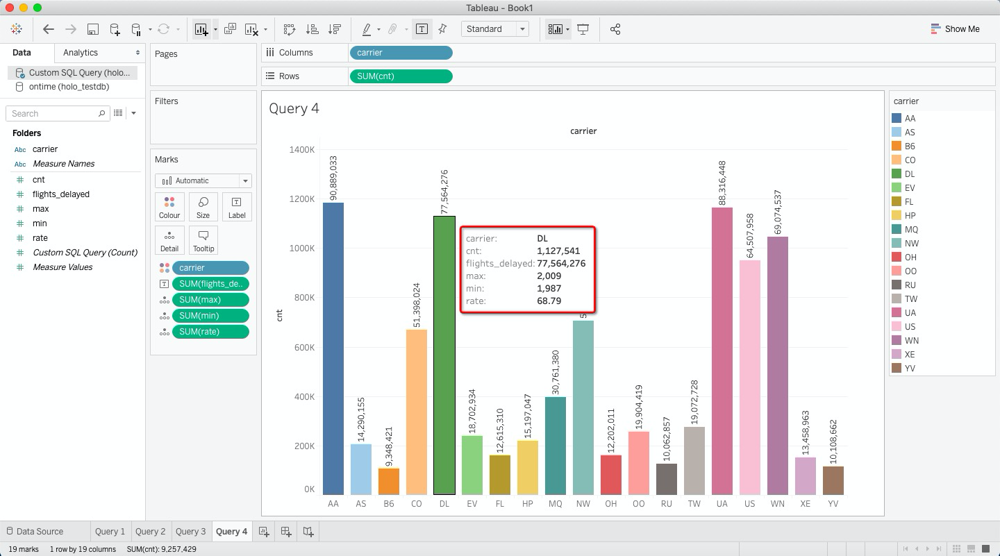


