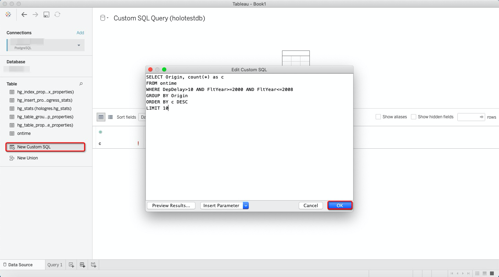

# Load, Query, and Visualize US Flight Dataset in Hologres 

In this tutorial, we will walk through examples of using Hologres and visualizing in Tableau by the following steps:

1.Data Preparation

2.Create Table in Hologres

3.Copy Data into Hologres 

4.Query 

5.Visualization in Tableau


## Data Preparation

1.Data Source

In this tutorial, we use flight data from [the US Department of Transportation](http://www.transtats.bts.gov/DL_SelectFields.asp?Table_ID=236&DB_Short_Name=On-Time).


There are scripts and loaders for the flight data ["On-Time Performance"](https://github.com/Percona-Lab/ontime-airline-performance) on Github.

2.Download the Dataset

If under Linux, go with the following script and download the data；
One thing to remember, choose one specific directory before you start （data would be downloaded under the current directory by default).

```
for s in `seq 1987 2018`
do
for m in `seq 1 12`
do
wget https://transtats.bts.gov/PREZIP/On_Time_Reporting_Carrier_On_Time_Performance_1987_present_${s}_${m}.zip
done
done
```


Data is stored in CSV (with ',' delimiter) format. Total uncompressed CSV files size is about 79852548 Bytes (about 77GB).


Note: the following 14 files contain invalid byte sequence for encoding, and thus fails to upload to Hologres.

| NO | FILES |
|---|---|
| 1 | On_Time_Reporting_Carrier_On_Time_Performance_(1987_present)_2001_1.csv |
| 2 | On_Time_Reporting_Carrier_On_Time_Performance_(1987_present)_2001_2.csv |
| 3 | On_Time_Reporting_Carrier_On_Time_Performance_(1987_present)_2001_3.csv |
| 4 | On_Time_Reporting_Carrier_On_Time_Performance_(1987_present)_2001_4.csv |
| 5 | On_Time_Reporting_Carrier_On_Time_Performance_(1987_present)_2001_5.csv |
| 6 | On_Time_Reporting_Carrier_On_Time_Performance_(1987_present)_2001_6.csv |
| 7 | On_Time_Reporting_Carrier_On_Time_Performance_(1987_present)_2001_7.csv |
| 8 | On_Time_Reporting_Carrier_On_Time_Performance_(1987_present)_2001_8.csv |
| 9 | On_Time_Reporting_Carrier_On_Time_Performance_(1987_present)_2001_9.csv |
| 10 | On_Time_Reporting_Carrier_On_Time_Performance_(1987_present)_2001_10.csv |
| 11 | On_Time_Reporting_Carrier_On_Time_Performance_(1987_present)_2001_11.csv |
| 12 | On_Time_Reporting_Carrier_On_Time_Performance_(1987_present)_2001_12.csv |
| 13 | On_Time_Reporting_Carrier_On_Time_Performance_(1987_present)_2002_1.csv |
| 14 | On_Time_Reporting_Carrier_On_Time_Performance_(1987_present)_2002_2.csv |


Let's delete these 14 files via the following commands:

```
# remove the files in 2001 .12 files in total  
rm -f On_Time_Reporting_Carrier_On_Time_Performance_\(1987_present\)_2001*.csv

# remove the files in 2002_1 and 2002_2 , 2 files in total  
rm -f On_Time_Reporting_Carrier_On_Time_Performance_\(1987_present\)_2002_1.csv
rm -f On_Time_Reporting_Carrier_On_Time_Performance_\(1987_present\)_2002_2.csv
```

3.Unzip the Dataset 

Once download the data, unzip it with the following script:

```
find . -name '*.zip'-exec unzip {} \；
```

The following warning might come, choose "N":
```
#replace readme.html? [y]es, [n]o, [A]ll, [N]one, [r]ename: 
```

## Create Table in Hologres 

Let's connect to Hologres via psql with the following command.

```
PGPASSWORD=<password> psql -U <username> -h <ip> -p <port> -d <database>
```

Now you have landed Hologres successfully(there shoud be no database by default).

Let's create some database and check.

```
CREATE DATABASE HOLO_TESTDB；
\l;
```

Let's save script into a file since the table we need is quite long. Create a file first, then save as a text file.

Create a file first as fowllowing.

```
mkdir /temp/ddl
```

Save the script into the file as "data.ddl".

```
BEGIN;
CREATE TABLE ontime (
  FltYear integer not null,
  FltQuarter integer not null,
  FltMonth integer not null,
  FltDayofMonth integer,
  FltDayOfWeek integer,
  FlightDate date,
  UniqueCarrier text,
  AirlineID integer,
  Carrier text,
  TailNum text,
  FlightNum text,
  OriginAirportID integer,
  OriginAirportSeqID integer,
  OriginCityMarketID integer,
  Origin text,
  OriginCityName text,
  OriginState text,
  OriginStateFips text,
  OriginStateName text,
  OriginWac integer,
  DestAirportID integer,
  DestAirportSeqID integer,
  DestCityMarketID integer,
  Dest text,
  DestCityName text,
  DestState text,
  DestStateFips text,
  DestStateName text,
  DestWac integer,
  CRSDepTime text,
  DepTime text,
  DepDelay numeric(13,2),
  DepDelayMinutes numeric(13,2),
  DepDel15 numeric(13,2),
  DepartureDelayGroups integer,
  DepTimeBlk text,
  TaxiOut numeric(13,2),
  WheelsOff text,
  WheelsOn text,
  TaxiIn numeric(13,2),
  CRSArrTime text,
  ArrTime text,
  ArrDelay numeric(13,2),
  ArrDelayMinutes numeric(13,2),
  ArrDel15 numeric(13,2),
  ArrivalDelayGroups integer,
  ArrTimeBlk text,
  Cancelled numeric(13,2),
  CancellationCode text,
  Diverted numeric(13,2),
  CRSElapsedTime numeric(13,2),
  ActualElapsedTime numeric(13,2),
  AirTime numeric(13,2),
  Flights numeric(13,2),
  Distance numeric(13,2),
  DistanceGroup integer,
  CarrierDelay numeric(13,2),
  WeatherDelay numeric(13,2),
  NASDelay numeric(13,2),
  SecurityDelay numeric(13,2),
  LateAircraftDelay numeric(13,2),
  FirstDepTime text,
  TotalAddGTime numeric(13,2),
  LongestAddGTime numeric(13,2),
  DivAirportLandings numeric(13,2),
  DivReachedDest numeric(13,2),
  DivActualElapsedTime numeric(13,2),
  DivArrDelay numeric(13,2),
  DivDistance numeric(13,2),
  Div1Airport text,
  Div1AirportID integer,
  Div1AirportSeqID integer,
  Div1WheelsOn text,
  Div1TotalGTime numeric(13,2),
  Div1LongestGTime numeric(13,2),
  Div1WheelsOff text,
  Div1TailNum text,
  Div2Airport text,
  Div2AirportID integer,
  Div2AirportSeqID integer,
  Div2WheelsOn text,
  Div2TotalGTime numeric(13,2),
  Div2LongestGTime numeric(13,2),
  Div2WheelsOff text,
  Div2TailNum text,
  Div3Airport text,
  Div3AirportID integer,
  Div3AirportSeqID integer,
  Div3WheelsOn text,
  Div3TotalGTime numeric(13,2),
  Div3LongestGTime numeric(13,2),
  Div3WheelsOff text,
  Div3TailNum text,
  Div4Airport text,
  Div4AirportID integer,
  Div4AirportSeqID integer,
  Div4WheelsOn text,
  Div4TotalGTime numeric(13,2),
  Div4LongestGTime numeric(13,2),
  Div4WheelsOff text,
  Div4TailNum text,
  Div5Airport text,
  Div5AirportID integer,
  Div5AirportSeqID integer,
  Div5WheelsOn text,
  Div5TotalGTime numeric(13,2),
  Div5LongestGTime numeric(13,2),
  Div5WheelsOff text,
  Div5TailNum text,
  trailer integer
);

CALL set_table_property('ontime', 'clustering_key', 'FltYear, FltQuarter, FltMonth');
CALL set_table_property('ontime', 'segment_key', 'FltYear');
CALL set_table_property('ontime', 'shard_count', '1');
CALL set_table_property('ontime', 'bitmap_columns', 'OriginState, DestState, FltDayofMonth, FltDayOfWeek, Carrier');
CALL set_table_property('ontime', 'dictionary_encoding_columns', 'UniqueCarrier, Carrier, TailNum, Origin, OriginCityName, OriginState, OriginStateName, Dest, DestCityName, DestState, DestStateName, DepTimeBlk, WheelsOff, WheelsOn, ArrTimeBlk, CancellationCode, Div1Airport, Div1WheelsOn, Div1WheelsOff, Div1TailNum, Div2Airport, Div2WheelsOn, Div2WheelsOff, Div2TailNum, Div3Airport, Div3WheelsOn, Div3WheelsOff, Div3TailNum, Div4Airport, Div4WheelsOn, Div4WheelsOff, Div4TailNum, Div5Airport, Div5WheelsOn, Div5WheelsOff, Div5TailNum');
CALL set_table_property('ontime', 'time_to_live_in_seconds', '31536000');
COMMIT;
```

After you finish the script file, execute the script file.

```
PGPASSWORD=<password> psql -U <username> -h <ip> -p <port> -d <database> -f /temp/data.ddl
```

```
BEGIN
CREATE TABLE
CALL
CALL
CALL
CALL
CALL
CALL
CALL
COMMIT
```

Let's check the table "ontime" we have executed.

```
\d ontime
```

Now you have prepared one database with one table.

## Copy Data into Hologres 

Let's copy data into table (374 files in total). Note: multiple csv files should be uploaded in 5 minutes by the following script:

```
cat /temp/*.csv |PGPASSWORD=[] psql -U [user] -h [host] -p [port] -d [database] -c 'copy ontime from stdin CSV HEADER'
```

If the error comes as follow:

```
ERROR:  exec query failed => status:7,error=ERROR:  Query:[20000745330718297] Get result failed: code: kActorInvokeError
msg: "code: kInternalError msg: \"status { code: SERVER_INTERNAL_ERROR message: \\\"query next from pg executor failed from 11.160.224.215:19577: failed to query next, detail:invalid byte sequence for encoding \\\\\\\"UTF8\\\\\\\": 0xe2 0x22 0x2c [method:QueryNext,transaction_id:20000745330718297,query_id:20000745330718297,batch_id:0,actor_id:837916746126030549:23,worker_address:11.160.224.215:37769,11.160.224.215:31851]\\\" }\""
```

As mentioned at the beginning, 14 files fails uploading for the invalid byte sequence for encoding. Delete them and reupload.

Let's do the final confirmation.

```
select count(*) from ontime;
```

```
count
-------
177821031
```

## Query

We prepare 10 queries for you to have a try:

1.--Query: Average monthly flight takeoff and landing records

```
SELECT avg(c1) 
FROM ( SELECT FltYear, FltMonth, count(*) as c1 FROM ontime GROUP BY FltYear, FltMonth ) A;
```

```
           avg           
-------------------------
 493947.3083333333333333
(1 row)

Time: 158.323 ms
```

2.--Query: Daily flights from 2000 to 2008

```
SELECT FltDayOfWeek, count(*) as c 
FROM ontime 
where FltYear>=2000 AND FltYear<=2008 
GROUP BY FltDayOfWeek 
ORDER BY c DESC;
```

```
fltdayofweek |    c    
--------------+---------
            5 | 7744593
            1 | 7732712
            4 | 7708836
            3 | 7682957
            2 | 7638935
            7 | 7335634
            6 | 6640380
(7 rows)

Time: 91.850 ms
```


3.--Query: Count the number of flights delayed from 2000 to 2008 (more than 10 minutes, the same below) by week

```

SELECT FltDayOfWeek, count(*) as c 
FROM ontime 
WHERE DepDelay>10 AND FltYear>=2000 AND FltYear<=2008 
GROUP BY FltDayOfWeek 
ORDER BY c DESC;
```

```
 fltdayofweek |    c    
--------------+---------
            5 | 1866572
            4 | 1713257
            1 | 1627548
            7 | 1596172
            3 | 1473600
            2 | 1386450
            6 | 1234510
(7 rows)

Time: 96.045 ms
```

4.--Query: Statistics of the number of delays from 2000 to 2008 by departure airport

```
SELECT Origin, count(*) as c 
FROM ontime 
WHERE DepDelay>10 AND FltYear>=2000 AND FltYear<=2008 
GROUP BY Origin 
ORDER BY c DESC 
LIMIT 10;
```

```
 origin |   c    
--------+--------
 ATL    | 759717
 ORD    | 757686
 DFW    | 530277
 PHX    | 344518
 LAX    | 340019
 LAS    | 316076
 DEN    | 312756
 EWR    | 270482
 IAH    | 262098
 DTW    | 254583
(10 rows)

Time: 103.428 ms
```

5.--Query: According to airline statistics, the number of delays in 2007

```
SELECT Carrier, count(*) 
FROM ontime
WHERE DepDelay>10 AND FltYear=2007 
GROUP BY Carrier 
ORDER BY count(*) DESC;
```

```
 carrier | count  
---------+--------
 WN      | 296293
 AA      | 176203
 MQ      | 145630
 US      | 135987
 UA      | 128174
 OO      | 127426
 EV      | 101796
 XE      |  99915
 DL      |  93675
 NW      |  90429
 CO      |  76662
 YV      |  67905
 FL      |  59460
 OH      |  59034
 B6      |  50740
 9E      |  46948
 AS      |  42830
 F9      |  23035
 AQ      |   4299
 HA      |   2746
(20 rows)

Time: 87.795 ms

```
6.--Query: According to airline statistics, the percentage of delays in 2007

```
SELECT Carrier, c, c2, c*100/c2 as c3
FROM  
  ( SELECT Carrier, count(*) as c FROM ontime WHERE depdelay>10 AND FltYear=2007 GROUP BY Carrier ) A 
  INNER JOIN 
  ( SELECT Carrier, count(*) as c2 FROM ontime WHERE FltYear=2007 GROUP BY Carrier ) B using (Carrier) 
ORDER BY c3 DESC;
```

```
 carrier |   c    |   c2    | c3 
---------+--------+---------+----
 EV      | 101796 |  286234 | 35
 US      | 135987 |  485447 | 28
 AA      | 176203 |  633857 | 27
 MQ      | 145630 |  540494 | 26
 B6      |  50740 |  191450 | 26
 UA      | 128174 |  490002 | 26
 AS      |  42830 |  160185 | 26
 OH      |  59034 |  236032 | 25
 WN      | 296293 | 1168871 | 25
 YV      |  67905 |  294362 | 23
 F9      |  23035 |   97760 | 23
 CO      |  76662 |  323151 | 23
 XE      |  99915 |  434773 | 22
 FL      |  59460 |  263159 | 22
 OO      | 127426 |  597880 | 21
 NW      |  90429 |  414526 | 21
 DL      |  93675 |  475889 | 19
 9E      |  46948 |  258851 | 18
 AQ      |   4299 |   46360 |  9
 HA      |   2746 |   56175 |  4
(20 rows)

Time: 196.614 ms
```

7.--Query: According to airline statistics, the percentage of delays from 2000 to 2008

```
SELECT Carrier, c, c2, c*100/c2 as c3 
FROM 
  ( SELECT Carrier, count(*) as c FROM ontime WHERE DepDelay>10 AND FltYear>=2000 AND FltYear<=2008 GROUP BY Carrier ) A 
  INNER JOIN 
  ( SELECT Carrier, count(*) as c2 FROM ontime WHERE FltYear>=2000 AND FltYear<=2008 GROUP BY Carrier ) B using (Carrier) 
ORDER BY c3 DESC;
```

```
 carrier |    c    |   c2    | c3 
---------+---------+---------+----
 EV      |  461050 | 1697172 | 27
 AS      |  307280 | 1247091 | 24
 B6      |  197249 |  811341 | 24
 YV      |  198787 |  854056 | 23
 WN      | 1937033 | 8170555 | 23
 FL      |  298916 | 1265138 | 23
 MQ      |  753627 | 3396041 | 22
 XE      |  233488 | 1036015 | 22
 F9      |   72150 |  336958 | 21
 UA      |  931597 | 4301810 | 21
 DH      |  147041 |  693047 | 21
 AA      | 1122645 | 5467736 | 20
 HP      |  196421 |  969738 | 20
 US      |  780805 | 3871953 | 20
 TW      |   54891 |  267131 | 20
 OH      |  301681 | 1466421 | 20
 CO      |  465109 | 2495036 | 18
 9E      |   89391 |  521059 | 17
 OO      |  556247 | 3090849 | 17
 NW      |  631058 | 3669508 | 17
 DL      |  887303 | 4957830 | 17
 RU      |  216279 | 1314294 | 16
 TZ      |   32998 |  208420 | 15
 AQ      |    9095 |  100583 |  9
 HA      |   15968 |  274265 |  5
(25 rows)


Time: 195.132 ms
```


8.--Query: Statistics of flight delay rate by year

```
SELECT FltYear, c1/c2 as ratio
FROM 
  ( SELECT FltYear, count(*)*100 as c1 FROM ontime WHERE DepDelay>10 GROUP BY FltYear ) A 
  INNER JOIN
  ( SELECT FltYear, count(*) as c2 FROM ontime GROUP BY FltYear ) B using (FltYear) 
ORDER BY FltYear ;
```

```
 fltyear | ratio 
---------+-------
    1987 |    19
    1988 |    16
    1989 |    19
    1990 |    16
    1991 |    14
    1992 |    14
    1993 |    15
    1994 |    16
    1995 |    19
    1996 |    22
    1997 |    19
    1998 |    19
    1999 |    20
    2000 |    23
    2002 |    16
    2003 |    15
    2004 |    19
    2005 |    20
    2006 |    23
    2007 |    24
    2008 |    21
    2009 |    19
    2010 |    20
    2011 |    20
    2012 |    19
    2013 |    22
    2014 |    23
    2015 |    21
    2016 |    19
    2017 |    20
    2018 |    20
(31 rows)

Time: 193.892 ms
```


9.--Query: Number of flights per year

```
SELECT FltYear, count(*) as c1 
FROM ontime  
GROUP BY FltYear;
```

```
 fltyear |   c1    
---------+---------
    2015 | 5819079
    1987 | 1311826
    2008 | 7009726
    1988 | 5202096
    1989 | 5041200
    2009 | 6450285
    2014 | 5819811
    2017 | 5165551
    1995 | 5327435
    2007 | 7455458
    1996 | 5351983
    2000 | 5683047
    2016 | 5617658
    1997 | 5411843
    2006 | 7141922
    1994 | 5180048
    2002 | 4435488
    1998 | 5384721
    2005 | 7140596
    1993 | 5070501
    1992 | 5092157
    2004 | 7129270
    1999 | 5527884
    2003 | 6488540
    2018 | 7213446
    1990 | 5270893
    2010 | 6450117
    2013 | 6369482
    2012 | 6096762
    2011 | 6085281
    1991 | 5076925
(31 rows)

Time: 76.353 ms
```

10.--Query: Multi-dimensional complex filtering and aggregation

```
SELECT 
  min(FltYear), 
  max(FltYear), 
  Carrier, 
  count(*) as cnt, 
  sum(ArrDelayMinutes) as flights_delayed, 
  round(sum(ArrDelayMinutes)/count(*), 2) as rate 
FROM ontime 
WHERE 
  FltDayOfWeek not in (6,7) AND 
  OriginState not in ('ak', 'hi', 'pr', 'vi') AND 
  DestState not in ('ak', 'hi', 'pr', 'vi') AND 
  ArrDelayMinutes > 30 AND
  FlightDate < '2010-01-01' 
GROUP BY Carrier HAVING count(*)>100000 AND max(FltYear)>1990 
ORDER BY rate DESC 
LIMIT 1000;
```

```
 min  | max  | carrier |   cnt   | flights_delayed | rate  
------+------+---------+---------+-----------------+-------
 2006 | 2009 | YV      |  113955 |     10108662.00 | 88.71
 2006 | 2009 | XE      |  152431 |     13458963.00 | 88.30
 2003 | 2009 | B6      |  107648 |      9348421.00 | 86.84
 2003 | 2006 | RU      |  126733 |     10062857.00 | 79.40
 2003 | 2009 | FL      |  159064 |     12615310.00 | 79.31
 2003 | 2009 | EV      |  237727 |     18702934.00 | 78.67
 2003 | 2009 | OO      |  257069 |     19904419.00 | 77.43
 2002 | 2009 | MQ      |  397504 |     30761380.00 | 77.39
 1987 | 2009 | CO      |  668965 |     51398024.00 | 76.83
 1987 | 2009 | AA      | 1183353 |     90889033.00 | 76.81
 2004 | 2009 | OH      |  160071 |     12202011.00 | 76.23
 1987 | 2009 | UA      | 1164271 |     88316448.00 | 75.86
 1987 | 2009 | NW      |  705335 |     51055143.00 | 72.38
 1987 | 2000 | TW      |  274399 |     19072728.00 | 69.51
 1987 | 2009 | AS      |  205613 |     14290155.00 | 69.50
 1987 | 2005 | HP      |  220228 |     15197047.00 | 69.01
 1987 | 2009 | DL      | 1127541 |     77564276.00 | 68.79
 1988 | 2009 | US      |  949609 |     64507958.00 | 67.93
 1987 | 2009 | WN      | 1045913 |     69074537.00 | 66.04
(19 rows)

Time: 167.635 ms
```

## Tableau

Tableau is a visual data management tool which can provide visual analysis by dragging and dropping.

We will example some queries to show you how to visualize data in Hologres via Tableau.

## Preparation work

### Preparation Work 1: Download Tableau Desktop:

Please follow the instruction : [Tableau Desktop](https://www.tableau.com/support/releases)

### Preparation Work 2: Connect to Hologres with Tableau

Choose PostgreSQL and fill in the necessary information below.


- Server: Hologres Instance Address
- Port: Hologres Port Address
- Database: Connected Hologres Database Name
- User Name: Hologres Account Access ID
- Password: Hologres Account Access Key
- Require SSL: No

After sign in you will see the table "ontime" under your hologres.


## Visualization in Tableau

### Query 1:

#### Step 1: Add one custom SQL

Tableau supports to drag the capsule to columns and rows directly to visualize report, but sometimes the data has so many values, in order to simplify the optional capsule we add one custom SQL to help us select the relevant capsule that we need of each query demand.

For example we would like to know the total flight number of each day of week from 2000 to 2008.

```
SELECT FltDayOfWeek, count(*) as c
FROM ontime
where FltYear>=2000 AND FltYear<=2008
GROUP BY FltDayOfWeek
ORDER BY c DESC
```

In this situantion we input the query and click ok.


With your query executed, the result will be showed here:


### Step 2: Create one work table, ensure each value in dimensions and measures correctiveness

Notes：

Measure: usually is consist of a group of variable figures which can be calculated, and based on the calculated results, it represents quantifiable visual elements of the chart such as the area size, bar length, color depth, etc.

Dimension: mainly used to distinguish the calculation results of numerical variables(Measure), which are shown as visual elements that are difficult to quantify, such as chart color types, graphic positions, classification methods, etc.

Drag the Fltdayofwork to dimensions, and keep the value need to be caculated in measures(here the value is C).


### Step 3: Drag the value to columns and rows to show the report

Drag the dimension value capsule(Fltdayofwork) to columns and drag the measure value capsule(C) to rows, as you can see we got the visualized report in the work list ( According to your preference you can switch the columns and rows).


As you can see while putting cursor on the report, it will show the exact flight numbers in dayofweek(7-Sunday) from 2000 to 2008.

### Query 2:

#### Step 1: Add one custom SQL

In this SQL we would like to know how many flights in total delayed according to different flights origin during 2000 to 2008.

```
SELECT Origin, count(*) as c
FROM ontime
WHERE DepDelay>10 AND FltYear>=2000 AND FltYear<=2008
GROUP BY Origin
ORDER BY c DESC
LIMIT 10
```




SQL query result：


#### Step 2: Create one work table, ensure each value in dimensions and measures correctiveness

According to different value attibutives，tableau displays each SQL's query result value to its data type: here origin is under dimensions and C is under measures which need to be cacultated.


#### Step 3: Drag the value to columns and rows to show the report

Drag origin to columns and c to rows, then we can see the report and while choosing any bar in the report you will be able to see the detailed graph.


### Query 3:

#### Step 1: Add one custom SQL

This query figures out the departure delay (departure delay time > 10min) ratio in 2007 according to different carriers.

```
SELECT Carrier, c, c2, c*100/c2 as c3
FROM
( SELECT Carrier, count(*) as c FROM ontime WHERE depdelay>10 AND FltYear=2007 GROUP BY Carrier ) A
INNER JOIN
( SELECT Carrier, count(*) as c2 FROM ontime WHERE FltYear=2007 GROUP BY Carrier ) B using (Carrier)
ORDER BY c3 DESC
```

Add one new custom SQL, input SQL and click ok, result will be showed in the work area.


In this visualized report we can see each carrier total flights (c2), total departure delaid (more than 10 min) fight numbers (c1) and the delay ratio (c3) in 2007.


#### Step 2: Create one work table, ensure each value in dimensions and measures correctiveness

In this work area，the dimensions and measures have already been matched by tableau automatically, we need to check again whether the value has been put in the correct category or not, if not, shift it to the correct category as we have done in query 1 step 2.


#### Step 3: Drag the value to columns and rows to show the report

Drag carrier to columns, c and c2 to rows the the detail will be showed as bar chart. In this report we put the delay ratio(c3) as label to each bar, which will be more clear. As usual click any of the bar, the data of the sepecific carrier will be showed as diagram in the work area.


### Query 4:

#### Step 1: Add one custom SQL

In this query we aim to analyse different carriers arrival delay time sum total, and the total arrival delay rate before 2010.

```
SELECT
min(FltYear),
max(FltYear),
Carrier,
count(*) as cnt,
sum(ArrDelayMinutes) as flights_delayed,
round(sum(ArrDelayMinutes)/count(*), 2) as rate
FROM ontime
WHERE
FltDayOfWeek not in (6,7) AND
OriginState not in ('ak', 'hi', 'pr', 'vi') AND
DestState not in ('ak', 'hi', 'pr', 'vi') AND
ArrDelayMinutes > 30 AND
FlightDate < '2010-01-01'
GROUP BY Carrier HAVING count(*)>100000 AND max(FltYear)>1990
ORDER BY rate DESC
LIMIT 1000
```

Same step as before add one new custom SQL and paste the SQL here then the result will be showed as below:


#### Step 2: Create one work table, ensure each value in dimensions and measures correctiveness


#### Step 3: Drag the value to colomns and rows to show the report

Drag carrier to columns.


Drag cnt to rows.


Drag max,min,rate as details (which will be showed when we click the bar as one graph).


Drag flights_delayed as label (for each carrier it directly shows on the top of the coresponding bar).


To make the report more clear, we can distinguish the carrier by color, drag the left folders carrier dimension to color marks, and the carrier legends are presented on the right of this work area.


Now the report has been finished and the detail will be presented as we click each bar.


